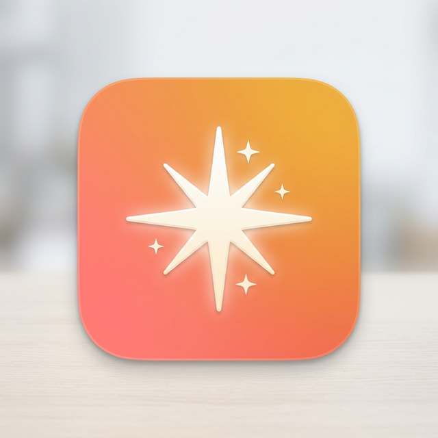

<p align="center">
  
</p>

# Appreciate ✨

🌐 [appreciate.srid.ca](https://appreciate.srid.ca)

A tiny app that periodically flashes customizable reminders across your screen as transparent overlays — nudging you to stay present, feel good, or remember whatever matters to you.

Comes with built-in **Reminder Packs** (Sensory, Actualism Method, Cooking, ...) and lets you create your own. Interval, position, font, color, and style are all **randomized** to prevent habituation.

Available for **macOS**, **Android**, **Windows**, and **Linux**.

## Features

- 🖥️ **Screen overlay** — reminder text appears directly on your desktop, then fades away
- 📦 **Reminder Packs** — built-in packs (Sensory, Actualism Method, Cooking) plus create your own
- ✏️ **Fully editable** — add, delete, and edit packs; each pack has multiple lines (random pick)
- 🎲 **Anti-habituation** — everything is randomized (timing, position, color, font, animation style)
- 🖥️🖥️ **Multi-monitor** — appears on all screens simultaneously (macOS, Windows)
- 🎯 **Background app** — menubar on macOS, foreground service on Android, system tray on Windows

---

## macOS

### Install from DMG

1. Download the latest `.dmg` from [Releases](../../releases)
2. Drag **Appreciate** to **Applications**
3. Remove quarantine (required for unsigned apps):
   ```bash
   xattr -cr /Applications/Appreciate.app
   ```
4. Open Appreciate — the ✨ icon appears in your menubar

### Build from source

```bash
cd macos
./build.sh
```

Requires Xcode Command Line Tools (`xcode-select --install`).

---

## Android

### Install from APK

1. Download the latest `.apk` from [Releases](../../releases)
2. Transfer to your phone and install (enable "Install from unknown sources" if prompted)
3. Open Appreciate → tap **"Grant Overlay Permission"** → enable the toggle
4. The app starts showing reminders immediately

### Build from source

```bash
nix develop                # enters dev shell with Android SDK, Java, Gradle
just deploy                # builds APK and installs to connected phone
```

Enable **USB debugging** on your phone first: Settings → About phone → tap Build number 7× → Developer options → USB debugging.

### First-time setup on phone

1. Open Appreciate
2. Tap **"⚠️ Grant Overlay Permission"** → toggle on for Appreciate
3. Back to app → **Enabled** switch is on by default
4. Done! Reminders will appear at random intervals

### Always On Display (AOD)

Appreciate registers as an Android Screensaver (Daydream). To show reminders on the Always On Display or when your device is idle:

1. Open Appreciate → tap **"🌙 Open Screen Saver Settings"**
2. Select **Appreciate** as your screen saver
3. Reminders will now appear on your lock screen / AOD when idle or charging

---

## Windows

### Install from EXE

1. Download the latest `.exe` from [Releases](../../releases)
2. Run it — the ✨ icon appears in your system tray
3. No special permissions needed

### Build from source

Requires [.NET 8 SDK](https://dotnet.microsoft.com/download/dotnet/8.0).

```bash
cd windows
dotnet run
```

To publish a single-file executable:
```bash
cd windows
dotnet publish -c Release -r win-x64 --self-contained
```

---

## Linux

### Install via Nix

```bash
nix run github:srid/Appreciate
```

### Install from tarball

1. Download the latest `.tar.gz` from [Releases](../../releases)
2. Extract and run:
   ```bash
   tar xzf Appreciate-Linux-*.tar.gz
   cd Appreciate-Linux
   ./run.sh
   ```
   Requires Python 3 and GTK4 (`python3-gi`, `gir1.2-gtk-4.0`).

---

## Usage

| Setting | Description |
|---|---|
| **Reminder Pack** | Select a pack, add new ones (+), or delete existing (−) |
| **Reminder Text** | Editable lines for the current pack; a random one is picked each time |
| **Enabled** | Toggle reminders on/off |
| **Launch at Login/Boot** | Auto-start on system startup |
| **Min/Max Interval** | Random interval range (default 6s–1.5min) |
| **Display Duration** | How long the overlay stays visible |
| **✨ Show Now** | Trigger a reminder immediately |

## Releasing

1. Go to [Actions → Release](../../actions/workflows/release.yml)
2. Click **Run workflow**
3. Enter a version tag (e.g. `v1.1.0`)
4. The workflow builds macOS DMG, Android APK, and Windows EXE, and attaches all to the Release

## License

MIT
